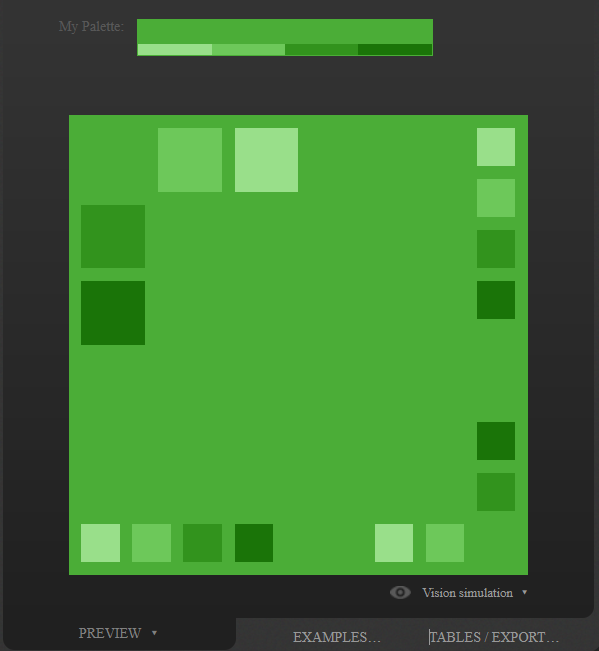

# Myecoapp Home

A website designed to help the environment by turning internet traffic into cash for causes.
Current Deploy `https://gorgeous-dusk-add814.netlify.app/`

# Components Designs and pages

- Home
  - Hero
  - Welcome/About
  - Goals
    - 3 - 6
  - Supporters
  - Funding
    - adverts
    - media
    - shop
    - games
  - Advert Break
  - FAQ
  - Meet the team
  
- myecohome - components
- lottery - to raise cash
- games - to entertain and drive traffic up
  - highscores page/leaderboards
- Profile - scores from games or achevments from the site
- Contact
- Account - personal information
- Services?
- About

## Required

- Register and login auth and token
- Basic username, email and password req.body
- Track users who log in to give them stats
- User acheievements and badges/ medals - log in x times
- Only a few protected routes - profiles
- socket.io for interactive high scores

## Design
Colour pallet based on logo green
